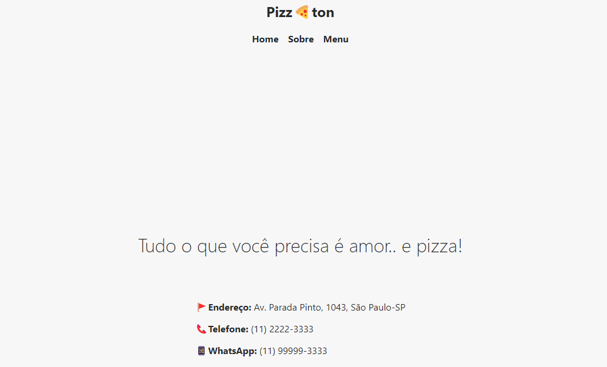

# Pizzaton

#### Último projeto do curso de React Direto ao Ponto

## 🎯 Objetivo

Esta é uma página de uma pizzaria e foi desenvolvido em Next.js.

## 📚 Páginas

O site é composto por 4 páginas diferentes:

- Home;
- Sobre;
- Menu;
- Página individual para cada Pizza;

## 🚀 Como executar o projeto

1. Clone este repositório

`$ https://github.com/giovanaraphaelli/pizzaton.git`

2. Acesse a pasta do projeto no seu terminal/cmd

`$ cd pizzaton`

3. Abra a pasta do projeto no VS Code via terminal/cmd

`$ code .`

4. Instale as dependências

`$ yarn install`

5. Execute a aplicação em modo de desenvolvimento

`$ yarn dev`

6. A aplicação será aberta na porta: 3000 - acesse http://localhost:3000
